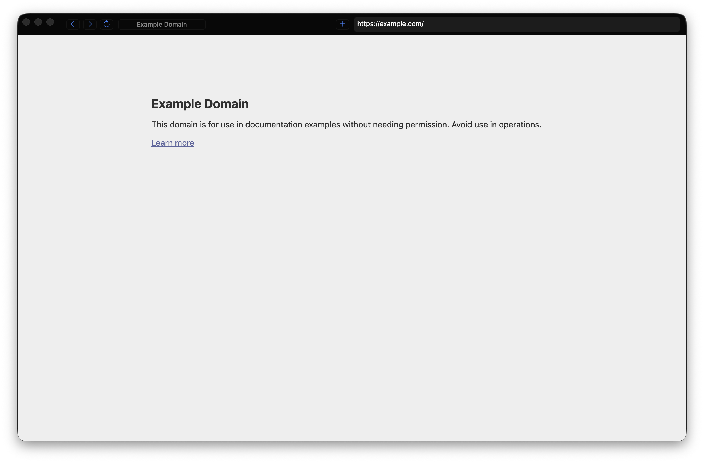

# Fakend Browser

Fakend Browser is a minimalist native macOS browser shell using Blink through
Chromium Embedded Framework (CEF). The UI target is black, compact, and fast:
tabs, a location field, and the page.



## Requirements

- macOS on Apple Silicon for the current scaffold.
- Flox.
- Apple Command Line Tools are enough for the current CMake/Ninja build.
  Full Xcode is still needed for Xcode UI or `xcodebuild` workflows.

## Environment

```sh
flox activate
```

Installed Flox tools are tracked in `.flox/env/manifest.toml`.

## Build Flow

```sh
flox activate -- scripts/doctor.sh
flox activate -- scripts/fetch-cef.sh
flox activate -- scripts/configure.sh
flox activate -- scripts/build.sh
flox activate -- scripts/package-dmg.sh
```

The CEF archive is intentionally not committed. `scripts/fetch-cef.sh` downloads
the current stable macOS ARM64 standard distribution from the official CEF build
index, verifies SHA1, extracts it under `vendor/cef/dist/`, and updates
`vendor/cef/current`.

`scripts/build.sh` also applies an ad-hoc local signature to the generated app
bundle so nested CEF framework/helper resources pass macOS verification during
development.

For isolated smoke tests, set `FAKEND_BROWSER_USER_DATA_DIR` to a temporary
directory before launching the app, or run:

```sh
flox activate -- scripts/smoke-gui.sh
```

The smoke script starts two tabs by default and checks for two separate
`Tab-*` profile roots, CEF helper/renderer processes, and a loaded
`Example Domain` page through DevTools. Override `EXPECTED_TAB_COUNT` or
`INITIAL_TAB_COUNT` when you need a narrower launch check.

## Usage

Launch the app, type a URL or search query in the location field, and press
Return. The browser supports the basic macOS shortcuts:

- `Cmd+L`: focus the location field.
- `Cmd+T`: new tab.
- `Cmd+W`: close tab.
- `Cmd+R`: reload.
- `Cmd+[` / `Cmd+]`: back and forward.

## Installing Downloaded Builds

Current release DMGs are development builds. They are ad-hoc signed but not
Developer ID signed or notarized, so macOS Gatekeeper may show:

```text
Apple could not verify "Fakend Browser" is free of malware that may harm your Mac or compromise your privacy.
```

Only run these builds if you trust the source. Building locally with the steps
above is the safer development path.

To try a downloaded build:

1. Download both the DMG and its `.sha256` file from the GitHub Release.
2. Verify the download:

   ```sh
   shasum -a 256 -c "Fakend Browser YYYY.M.N.dmg.sha256"
   ```

3. Open the DMG and drag `Fakend Browser.app` to `/Applications`.
4. Try Finder first: control-click `/Applications/Fakend Browser.app`, choose
   Open, then choose Open again if macOS offers that option.
5. If macOS still blocks it, remove the local quarantine flag:

   ```sh
   xattr -dr com.apple.quarantine "/Applications/Fakend Browser.app"
   open "/Applications/Fakend Browser.app"
   ```

Removing quarantine is only a local Gatekeeper bypass for this copy of the app.
It does not make the binary trusted or notarized. Proper Developer ID signing
and notarization are still TODOs before distributing this as a normal macOS app.

## Releases

GitHub Actions has a manual `Release` workflow. Running it computes the next
CalVer tag for the current UTC month:

- First release in a month: `vYYYY.M.1`
- Later releases in the same month: `vYYYY.M.2`, `vYYYY.M.3`, ...

The workflow builds on `macos-15` ARM64, creates a signed app bundle, packages
`Fakend Browser YYYY.M.N.dmg`, and publishes it to a GitHub Release.

Release notes are generated with OpenAI from the commit subjects and changed
files since the previous tag. Configure an `OPENAI_API_KEY` repository secret;
optionally set `OPENAI_RELEASE_NOTES_MODEL` as a repository variable to override
the default model.

## Current State

This repository currently contains the project plan, Flox environment, CMake
scaffold, native AppKit shell, CEF bridge classes, helper scripts, and a local
build of `build/Fakend Browser.app`. A GUI smoke test starts CEF and creates a
per-tab profile under an isolated temp user-data directory.
